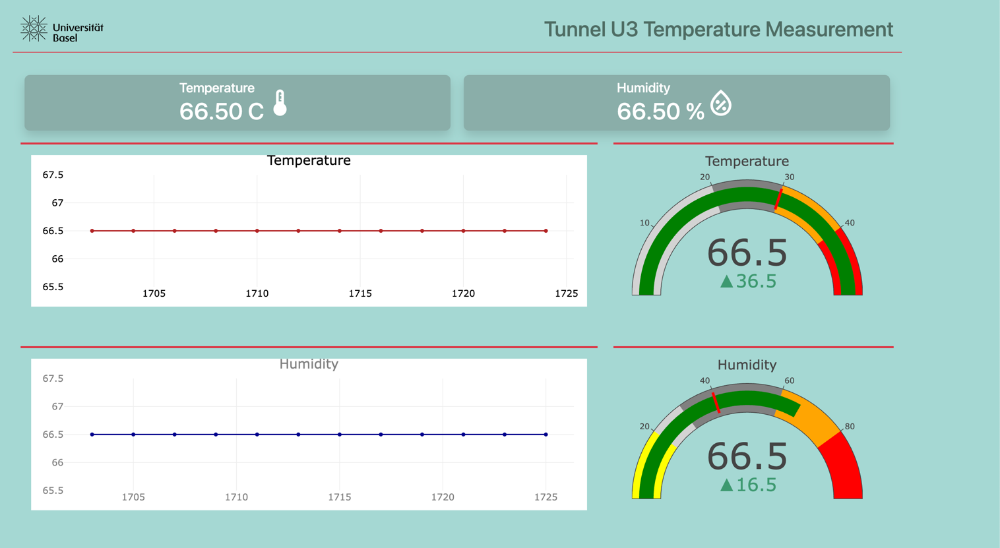

**Raspberry Pi DHT22 Temperature measurement station Flask SocketIO)**



This repo is fork of [dht22-weather-station-python-flask-socketio](https://github.com/donskytech/dht22-weather-station-python-flask-socketio.git)
 
**Features**

    •	Real-time temperature and humidity readings via DHT22.
	•	Historical data visualization with Plotly.js.
	•	Remote machine startup using Wake-on-LAN (WOL).
	•	Clean, responsive web UI styled with Bootstrap 5.


**Connection:**


**Setup Instructions**

 - Clone git repository:

````
git clone https://github.com/AmaRocket/DHT22.git
cd dht22-weather-station-python-flask-socketio
````
 - Create a Python virtual environment:
````
python -m venv .dht_22_venv
source .dht_22_venv/bin/activate
````
 - Install the dependencies:
```
pip install -r requirements.txt
```
 - Run app:
```
flask run --host=0.0.0.0
```
 - Access the application using the following URL
```
http://<IP>:5000
```
